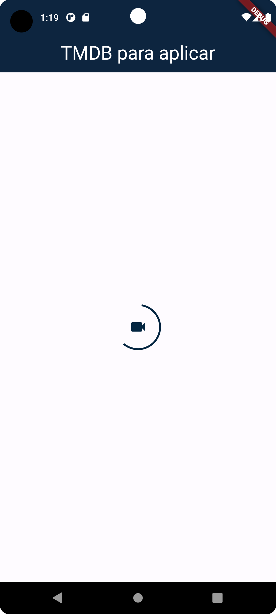
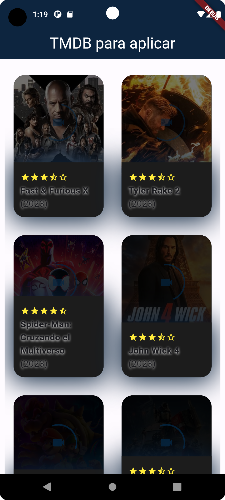
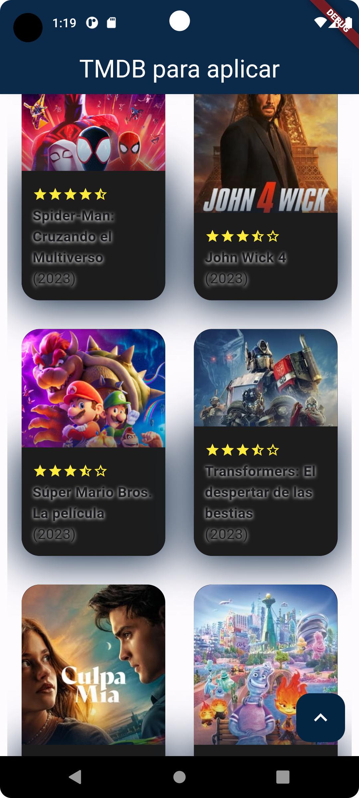
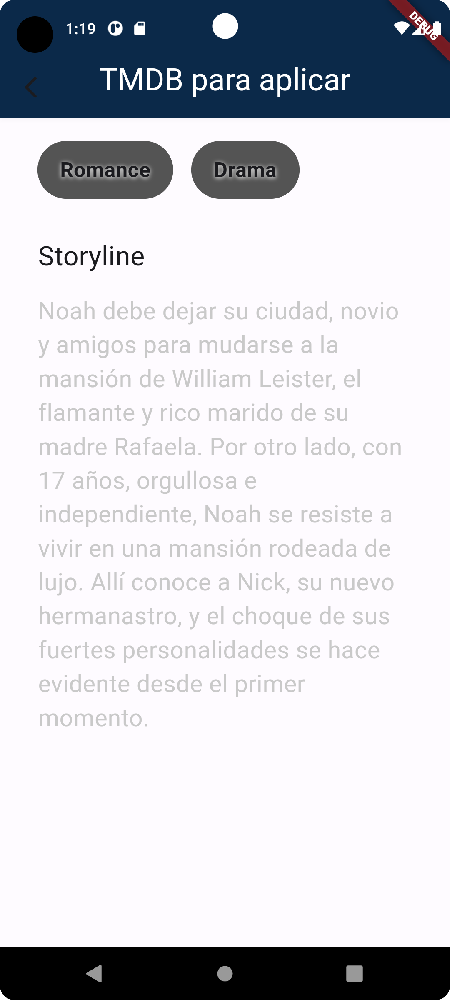

# tmdb

App para comsumir el API pública para desarrolladores de TheMovieDB.

## Getting Started

Crear una App móvil con Flutter que consuma los endpoints señalados en las instrucciones que son expuestos a través de una API pública para desarrolladores.
La aplicación debe ser capaz de mostrar el listado de las películas más populares así como el acceso al detalle de cada una con toda la información de esta.
Se deberá utilizar un manejador de estados para facilitar la estructura de los datos.
El código fuente deberá ser subido a Github con su respectivo Readme.md con instrucciones para el despliegue y pruebas de la aplicación.

Se valorará la estructuración del código, limpieza y calidad de este.

Instrucciones
1- Acceder al servicio público de The Movie DB [https://developers.themoviedb.org/3/getting-started](https://developers.themoviedb.org/3/getting-started)

2- Crearse una cuenta en este servicio y generar una API KEY en [https://www.themoviedb.org/settings/api](https://www.themoviedb.org/settings/api)

3- Consumir los endpoints
- [https://developers.themoviedb.org/3/movies/get-popular-movies](https://developers.themoviedb.org/3/movies/get-popular-movies)
- [https://developers.themoviedb.org/3/movies/get-movie-details](https://developers.themoviedb.org/3/movies/get-popular-movies)

4- En el fichero constants.dart dentro de utils la variable themoviedbApi es donde se pone el apiKey de ThemovieDB.

